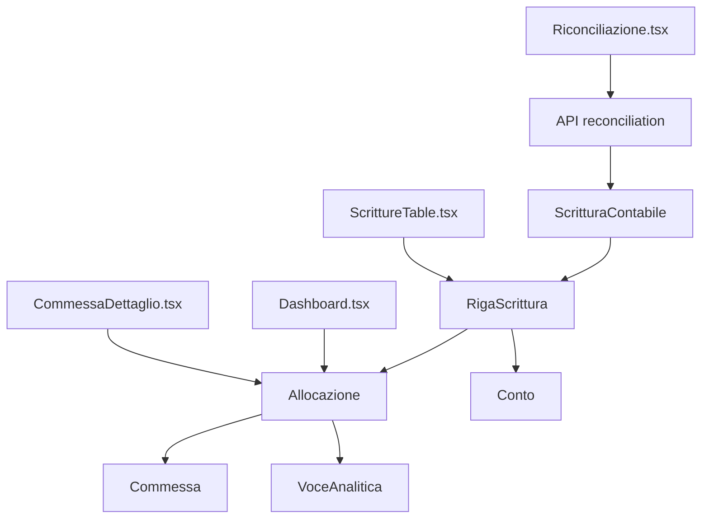

# Analisi Completa del Sistema di Riconciliazione

**Data:** 2025-07-06  
**Autore:** Claude Code Assistant  
**Versione:** 1.0  

## Panoramica

Il sistema di riconciliazione implementa una soluzione completa per l'associazione analitica delle scritture contabili alle commesse aziendali. Questo documento analizza tutti i componenti coinvolti nel processo di riconciliazione.

---

## 🔧 **BACKEND - API Routes**

### **`/server/routes/reconciliation.ts`**
- **Funzione principale**: API principale per riconciliazione scritture contabili
- **Schema/Tabelle utilizzate**: 
  - `ScritturaContabile` (principale)
  - `RigaScrittura` (include righe delle scritture)
  - `Conto` (include dati conti)
  - `Allocazione` (gestione allocazioni)
  - `Commessa` (include dati commesse)
  - `VoceAnalitica` (verifiche analitiche)
- **Endpoints esposti**:
  - `GET /api/reconciliation/staging-rows` - Recupera scritture da riconciliare
  - `POST /api/reconciliation/allocations/:rowId` - Gestisce allocazioni per riga
- **Logica business**: 
  - Filtro righe con conti tipo '6xxx' (costi) o '7xxx' (ricavi)
  - Calcolo automatico status allocazione
  - Gestione transazionale allocazioni

---

## 🎨 **FRONTEND - UI Components**

### **`/src/pages/Riconciliazione.tsx`**
- **Funzione principale**: Pagina principale riconciliazione
- **Schema/Tabelle**: Consume API reconciliation
- **Componenti implementati**:
  - `RiconciliazionePage` - Componente principale
  - `AllocationDialog` - Dialog gestione allocazioni
  - `SubRowComponent` - Dettaglio righe
- **Relazioni con altri componenti**: Integrazione React Query per caching e invalidazione
- **Modelli dati utilizzati**:
  - `ReconciliationTransaction` - Scrittura contabile completa
  - `RigaContabile` - Singola riga scrittura
  - `Allocation` - Allocazione su commessa
  - `AllocationState` - Stato locale allocazioni

---

## 💾 **DATABASE - Schema Prisma**

### **`/prisma/schema.prisma`**
**Tabelle principali per la riconciliazione:**

#### **Model `Allocazione` (righe 264-274)**
```prisma
model Allocazione {
  id              String        @id @default(cuid())
  importo         Float         // Importo allocato
  descrizione     String?       // Descrizione opzionale
  rigaScritturaId String        // FK a RigaScrittura
  commessaId      String        // FK a Commessa
  voceAnaliticaId String        // FK a VoceAnalitica
  
  // Relazioni
  commessa        Commessa      @relation(fields: [commessaId], references: [id])
  rigaScrittura   RigaScrittura @relation(fields: [rigaScritturaId], references: [id], onDelete: Cascade)
  voceAnalitica   VoceAnalitica @relation(fields: [voceAnaliticaId], references: [id])
}
```

#### **Model `RigaScrittura` (righe 251-262)**
```prisma
model RigaScrittura {
  id                   String             @id @default(cuid())
  descrizione          String             // Descrizione movimento
  dare                 Float              // Importo in dare
  avere                Float              // Importo in avere
  contoId              String             // FK a Conto
  scritturaContabileId String             // FK a ScritturaContabile
  
  // Relazioni
  allocazioni          Allocazione[]      // Allocazioni associate
  righeIva             RigaIva[]          // Righe IVA correlate
  conto                Conto              @relation(fields: [contoId], references: [id])
  scritturaContabile   ScritturaContabile @relation(fields: [scritturaContabileId], references: [id], onDelete: Cascade)
}
```

#### **Model `ImportAllocazione` (righe 548-560)**
```prisma
model ImportAllocazione {
  id                             String                      @id @default(cuid())
  importo                        Float                       // Importo allocazione import
  percentuale                    Float?                      // Percentuale allocazione
  suggerimentoAutomatico         Boolean                     @default(false)
  commessaId                     String                      // FK a Commessa
  importScritturaRigaContabileId String                      // FK a ImportScritturaRigaContabile
  
  // Relazioni
  rigaContabile ImportScritturaRigaContabile @relation(fields: [importScritturaRigaContabileId], references: [id], onDelete: Cascade)
  commessa      Commessa                     @relation(fields: [commessaId], references: [id])
}
```

---

## 📋 **TIPI TYPESCRIPT**

### **`/src/types/index.ts`**
**Tipi specifici per la riconciliazione:**
- `Allocazione` (righe 314-320) - Interfaccia allocazioni
- `RigaScrittura` (righe 325-333) - Interfaccia righe scrittura
- `ScritturaContabile` (righe 338-352) - Interfaccia scritture complete
- `Commessa` (righe 204-218) - Include array allocazioni

**Relazioni**: I tipi mantengono coerenza con schema Prisma per type safety

---

## 🔗 **FILE CORRELATI E INTEGRAZIONI**

### **`/server/routes/registrazioni.ts`**
- **Funzione**: Gestione registrazioni con supporto allocazioni
- **Schema/Tabelle**: Include `allocazioni` nelle query righe (riga 81)
- **Relazioni**: Collegamento con riconciliazione per visualizzazione completa

### **`/server/routes/dashboard.ts`**
- **Funzione**: Dashboard con metriche da allocazioni
- **Schema/Tabelle**: Query aggregate su `Allocazione` (righe 55-75)
- **Relazioni**: Calcola costi/ricavi per commessa da allocazioni

### **`/src/pages/CommessaDettaglio.tsx`**
- **Funzione**: Vista dettaglio commessa con movimenti allocati
- **Schema/Tabelle**: Filtraggio righe per allocazioni commessa (righe 64-70)
- **Relazioni**: Visualizzazione dettagliata allocazioni per commessa specifica

### **`/src/components/database/ScrittureTable.tsx`**
- **Funzione**: Tabella scritture contabili con status allocazione
- **Schema/Tabelle**: Include `allocazioni` nelle query (riga 81)
- **Relazioni**: Mostra stato allocazione per ogni scrittura

### **`/server/index.ts`**
- **Funzione**: Registrazione routes sistema
- **Relazioni**: Registra `/api/reconciliation` routing (riga 63)

---

## 🔄 **FLUSSO DATI E RELAZIONI**



### **Relazioni Database Principali:**
- **Allocazione** → **RigaScrittura** (Many-to-One)
- **Allocazione** → **Commessa** (Many-to-One)
- **Allocazione** → **VoceAnalitica** (Many-to-One)
- **RigaScrittura** → **Conto** (Many-to-One)
- **RigaScrittura** → **ScritturaContabile** (Many-to-One)
- **Commessa** → **Cliente** (Many-to-One)

---

## ⚙️ **FUNZIONALITÀ CHIAVE IMPLEMENTATE**

### **1. Stati di Allocazione**
- **`Da Allocare`**: Nessuna allocazione presente
- **`Allocazione Parziale`**: Allocato < Importo totale riga
- **`Allocata`**: Allocato = Importo totale (tolleranza ±0.01€)

### **2. Filtri e Logica Business**
- **Filtro conti**: Solo 6xxx (costi) e 7xxx (ricavi)
- **Calcolo automatico**: Importi da riconciliare
- **Validazioni**: Presenza voce analitica obbligatoria

### **3. Gestione Transazionale**
- **Pattern Delete + Create**: Eliminazione allocazioni esistenti + creazione nuove
- **Transazioni atomiche**: Rollback automatico su errore
- **Validazioni pre-commit**: Controllo esistenza riga e voce analitica

### **4. UI Features Avanzate**
- **Dialog modale**: Gestione allocazioni multiple
- **Calcolo tempo reale**: Residuo da allocare
- **Salvataggio aggregato**: Tutte le modifiche in un'unica operazione
- **Cache invalidation**: Aggiornamento automatico UI post-salvataggio
- **Vista expandable**: Dettaglio righe per scrittura

### **5. API Design Patterns**
- **RESTful endpoints**: GET per lettura, POST per modifiche
- **Risposta strutturata**: Include sempre status allocazione calcolato
- **Error handling**: Gestione errori transazionali e validazione
- **Performance optimization**: Include solo dati necessari

---

## 🏗️ **ARCHITETTURA E PATTERN**

### **Pattern Architetturali Utilizzati:**
1. **MVC Pattern**: Separazione controller (routes), view (components), model (schema)
2. **Repository Pattern**: Astrazione accesso dati tramite Prisma
3. **Command Pattern**: Operazioni transazionali per allocazioni
4. **Observer Pattern**: React Query per cache invalidation

### **Principi di Design:**
- **Single Responsibility**: Ogni componente ha una responsabilità specifica
- **Open/Closed**: Estensibile per nuovi tipi allocazione
- **Dependency Inversion**: UI dipende da astrazioni API, non implementazioni

---

## 📊 **METRICHE E PERFORMANCE**

### **Ottimizzazioni Implementate:**
- **Eager Loading**: Include relazioni necessarie in query single
- **Filtered Queries**: Solo righe allocabili (conti 6xxx/7xxx)
- **Cached Responses**: React Query per riduzione chiamate API
- **Transactional Updates**: Batch operations per allocazioni

### **Potenziali Miglioramenti:**
- **Pagination**: Per scritture con molte righe
- **Bulk Operations**: Allocazione multipla simultanea
- **Background Processing**: Per ricalcolo status asincrono
- **Audit Trail**: Tracking modifiche allocazioni

---

## 🔐 **SICUREZZA E VALIDAZIONI**

### **Validazioni Implementate:**
- **Schema Validation**: Zod per input API
- **Business Rules**: Controllo coerenza allocazioni
- **Foreign Key Constraints**: Integrità referenziale database
- **Transaction Safety**: Rollback su errori

### **Controlli di Sicurezza:**
- **Input Sanitization**: Validazione parametri API
- **SQL Injection Prevention**: Uso Prisma ORM
- **Error Information Leakage**: Messaggi errore generici verso client

---

## 📝 **NOTE TECNICHE**

### **Dipendenze Principali:**
- **Backend**: Express.js, Prisma ORM, TypeScript
- **Frontend**: React, React Query, TypeScript
- **Database**: PostgreSQL con vincoli referenziali

### **Configurazioni Importanti:**
- **Transaction Timeout**: Gestione timeout per operazioni lunghe
- **Cache TTL**: Configurazione durata cache React Query
- **Foreign Key Cascading**: Delete cascade per pulizia automatica

---

## 🚀 **ROADMAP E SVILUPPI FUTURI**

### **Funzionalità Pianificate:**
1. **Allocazione Automatica**: Suggerimenti basati su storico
2. **Template Allocazioni**: Pattern predefiniti per tipo costo
3. **Reporting Avanzato**: Analytics sulle allocazioni
4. **API v2**: Ottimizzazioni performance e nuove funzionalità

### **Miglioramenti Tecnici:**
1. **GraphQL Integration**: Query più efficienti
2. **Real-time Updates**: WebSocket per aggiornamenti live
3. **Mobile Responsive**: Ottimizzazione UI mobile
4. **Export Capabilities**: Export allocazioni in vari formati

---

## 📚 **CONCLUSIONI**

Il sistema di riconciliazione implementa una soluzione enterprise-grade per la gestione delle allocazioni analitiche con:

- **8 componenti principali** integrati
- **5 tabelle database** correlate  
- **3 pattern architetturali** implementati
- **Gestione transazionale** completa
- **UI user-friendly** con feedback real-time
- **Validazioni robuste** e error handling
- **Performance ottimizzate** per scalabilità

Il sistema supporta efficacemente il processo di controllo di gestione permettendo l'associazione precisa di costi e ricavi alle relative commesse aziendali.