# Piano di Ristrutturazione: Architettura Gestione Commesse

**Data:** 2025-07-06  
**Autore:** Claude Code Assistant  
**Versione:** 1.0  
**Stato:** In Sviluppo  

## 📋 **OBIETTIVO GENERALE**

Ristrutturare l'architettura del sistema per implementare una gestione commesse enterprise-grade che sfrutti tutti i dati importati e automatizzi il processo di allocazione, eliminando la necessità di riconciliazione manuale dove possibile.

---

## 🎯 **PROBLEMI IDENTIFICATI DALL'ANALISI**

### **1. MANCANZA DI RELAZIONI INTELLIGENTI**
- I conti dei movimenti non vengono classificati correttamente
- Non distinguiamo tra conti patrimoniali (2010000070 = fornitore) e conti economici (6015002102 = costo)
- Manca lookup automatico nelle tabelle Cliente/Fornitore per i sottoconti

### **2. DATI MOVANAC.TXT NON UTILIZZATI**
- File presente ma non processato
- Contiene allocazioni automatiche precise per riga contabile
- Eliminerebbe la necessità di riconciliazione manuale per molti movimenti

### **3. MANCANZA TABELLE DI RACCORDO**
- Nessun mapping Piano Conti → Voci Analitiche
- Nessuna logica di ripartizione automatica per costi indiretti
- Ogni movimento richiede classificazione manuale

### **4. ARCHITETTURA UI INCOMPATIBILE**
- Riconciliazione mostra solo importi totali per scrittura
- Non mostra dettaglio righe con natura economica vs patrimoniale
- Manca distinzione movimenti economici vs finanziari

---

## 🏗️ **PIANO DI RISTRUTTURAZIONE**

### **FASE 1: ANALISI E CLASSIFICAZIONE AUTOMATICA CONTI**

#### **F1.1: Implementare Logica di Classificazione Conti**
```typescript
// Nuovo servizio: ContoClassificationService
interface ContoClassification {
  tipo: 'CLIENTE' | 'FORNITORE' | 'ECONOMICO' | 'PATRIMONIALE' | 'FINANZIARIO';
  sottoTipo?: 'COSTO' | 'RICAVO' | 'ATTIVO' | 'PASSIVO';
  entitaCollegata?: {
    tipo: 'Cliente' | 'Fornitore';
    id: string;
    nome: string;
  };
  voceAnaliticaSuggerita?: string;
}
```

**Logica di implementazione:**
1. **Pattern Recognition**: Analizzare tutti i codici conti per identificare pattern
2. **Master Analysis**: Identificare mastri (es. 2010 = Fornitori, 1410 = Clienti)
3. **Cross-Reference**: Collegare sottoconti alle anagrafiche tramite pattern matching
4. **Auto-Classification**: Classificare automaticamente ogni conto al momento dell'import

#### **F1.2: Creare Tabella di Mappatura Analitica**
```sql
CREATE TABLE ContoVoceAnaliticaMapping (
  contoId VARCHAR(50) PRIMARY KEY,
  voceAnaliticaId VARCHAR(50) NOT NULL,
  tipoMovimento ENUM('COSTO', 'RICAVO'),
  allocazioneAutomatica BOOLEAN DEFAULT FALSE,
  percentualeDefault DECIMAL(5,2),
  commessaDefault VARCHAR(50),
  FOREIGN KEY (voceAnaliticaId) REFERENCES VoceAnalitica(id)
);
```

#### **F1.3: Pattern Analysis Engine**
Creare algoritmo che analizza:
- **Codici conti esistenti** vs **anagrafiche esistenti**
- **Pattern numerici** (es. 2010xxxxxx sempre fornitori)
- **Frequenza associazioni** per validare regole
- **Conflitti e ambiguità** da risolvere manualmente

---

### **FASE 2: IMPLEMENTAZIONE PARSER MOVANAC.TXT**

#### **F2.1: Parser Multi-File Integrato**
```typescript
interface MovimentoContabileCompleto {
  testata: ValidatedPnTesta;
  righeContabili: RigaContabileClassificata[];
  righeIva: ValidatedPnRigIva[];
  allocazioniAutomatiche: AllocazioneAutomatica[];
}

interface RigaContabileClassificata extends ValidatedPnRigCon {
  classificazione: ContoClassification;
  allocazioniMovanac?: AllocazioneMovanac[];
}

interface AllocazioneMovanac {
  centroDiCosto: string; // ID commessa
  importo: number;
  percentuale?: number;
}
```

#### **F2.2: Workflow Allocazione Gerarchica**
```typescript
// Gerarchia di allocazione (come suggerito dall'analisi)
enum TipoAllocazione {
  AUTOMATICA_MOVANAC = 1,    // Priorità massima
  AUTOMATICA_REGOLE = 2,     // Regole predefinite  
  MANUALE = 3                // Fallback manuale
}
```

#### **F2.3: Integrazione nel Transformer**
Modificare `scrittureContabiliTransformer.ts` per:
1. Processare MOVANAC.TXT durante l'import
2. Creare allocazioni automatiche dove disponibili
3. Flaggare movimenti che richiedono riconciliazione manuale

---

### **FASE 3: RISTRUTTURAZIONE UI E WORKFLOW**

#### **F3.1: Nuova Architettura Riconciliazione**
```typescript
interface MovimentoRiconciliazione {
  scritturaId: string;
  data: Date;
  descrizione: string;
  fornitore?: AnagraficaInfo;
  cliente?: AnagraficaInfo;
  
  righeEconomiche: RigaEconomica[];  // Solo 6xxx, 7xxx
  righePatrimoniali: RigaPatrimoniale[]; // Solo informative
  righeFinanziarie: RigaFinanziaria[];   // Escluse da allocazione
  
  statusAllocazione: 'AUTOMATICA' | 'PARZIALE' | 'MANUALE' | 'COMPLETATA';
  tipoMovimento: 'ECONOMICO' | 'FINANZIARIO' | 'MISTO';
}
```

#### **F3.2: Smart UI Components**
- **Movimento Economico**: Mostra righe allocabili con suggerimenti automatici
- **Movimento Finanziario**: Mostra solo per informazione, non allocabile
- **Movimento Misto**: Separa visivamente parti economiche vs finanziarie

#### **F3.3: Workflow Decisionale**

```mermaid
graph TD
    A[Import Movimento] --> B{Ha MOVANAC?}
    B -->|Sì| C[Allocazione Automatica]
    B -->|No| D{Ha Regole Auto?}
    D -->|Sì| E[Allocazione da Regole]
    D -->|No| F{È Economico?}
    F -->|Sì| G[Riconciliazione Manuale]
    F -->|No| H[Skip - Movimento Finanziario]
    
    C --> I[Completed]
    E --> I
    G --> I
    H --> I
```


---

### **FASE 4: SISTEMA REGOLE AUTOMATICHE (DETTANAL.TXT interno)**

#### **F4.1: Engine Regole di Ripartizione**
```sql
CREATE TABLE RegoleRipartizione (
  id VARCHAR(50) PRIMARY KEY,
  contoId VARCHAR(50),
  nome VARCHAR(100),
  tipoRegola ENUM('PERCENTUALE', 'IMPORTO_FISSO', 'CONDIZIONALE'),
  attiva BOOLEAN DEFAULT TRUE,
  
  FOREIGN KEY (contoId) REFERENCES Conto(id)
);

CREATE TABLE DettaglioRipartizione (
  regoleRipartizioneId VARCHAR(50),
  commessaId VARCHAR(50),
  percentuale DECIMAL(5,2),
  importoFisso DECIMAL(10,2),
  condizione JSON,
  
  FOREIGN KEY (regoleRipartizioneId) REFERENCES RegoleRipartizione(id),
  FOREIGN KEY (commessaId) REFERENCES Commessa(id)
);
```

#### **F4.2: UI Gestione Regole**
Interfaccia per configurare:
- **Regole per Conto**: Cancelleria → 100% Spese Generali
- **Regole Condizionali**: Carburante → Se fornitore = KUWAIT then ripartisci per km commesse
- **Regole Temporali**: Affitti → Ripartizione mensile automatica

---

### **FASE 5: INTEGRAZIONE E TESTING**

#### **F5.1: Migrazione Dati Esistenti**
Script per:
1. Riclassificare movimenti esistenti
2. Applicare nuove regole retroattivamente
3. Identificare movimenti che necessitano revisione manuale

#### **F5.2: Testing Workflow Completo**
1. **Import MOVANAC**: Verificare allocazioni automatiche
2. **Fallback Regole**: Testare regole predefinite
3. **Riconciliazione Residua**: Solo movimenti senza automazione
4. **Reporting**: Dashboard con % automazione raggiunta

---

## 📊 **RISULTATI ATTESI**

### **METRICHE DI SUCCESSO**
- **Automazione >80%**: Riduzione riconciliazione manuale
- **Classificazione Automatica**: Conti classificati correttamente
- **Zero Errori Foreign Key**: Sistema robusto
- **UX Migliorata**: Workflow intuitivo e veloce

### **BENEFICI BUSINESS**
- **Riduzione Tempo**: Da ore a minuti per riconciliazione
- **Accuratezza**: Meno errori umani
- **Scalabilità**: Gestione volumi maggiori
- **Insights**: Report automatici su allocazioni

---

## 📅 **TIMELINE IMPLEMENTAZIONE**

| Fase | Durata Stimata | Dipendenze |
|------|---------------|------------|
| F1 - Classificazione Conti | 2-3 settimane | Analisi dati esistenti |
| F2 - Parser MOVANAC | 1-2 settimane | F1 completata |
| F3 - Ristrutturazione UI | 2-3 settimane | F2 completata |
| F4 - Sistema Regole | 1-2 settimane | F3 completata |
| F5 - Integrazione | 1 settimana | Tutte le fasi |

**TOTALE STIMATO: 7-11 settimane**

---

## 🚨 **RISCHI E MITIGAZIONI**

### **RISCHIO 1: Complessità Pattern Recognition**
**Mitigazione**: Iniziare con regole semplici, raffinare iterativamente

### **RISCHIO 2: Dati MOVANAC Incompleti**
**Mitigazione**: Fallback su regole automatiche + manuale

### **RISCHIO 3: Resistenza al Cambiamento**
**Mitigazione**: Mantenere compatibilità con workflow esistente durante transizione

---

## 🔄 **STRATEGIA DI ROLLOUT**

### **APPROCCIO GRADUALE**
1. **Alpha**: Solo classificazione automatica conti
2. **Beta**: + Parser MOVANAC per subset dati
3. **Gamma**: + UI ristrutturata
4. **Release**: Sistema completo con regole automatiche

### **ROLLBACK PLAN**
Mantenere sistema attuale parallelo durante fase di testing per rollback immediato se necessario.

---

## 💡 **INNOVAZIONI CHIAVE**

1. **Pattern Recognition Engine**: Classificazione automatica conti
2. **Multi-Source Allocation**: MOVANAC + Regole + Manuale
3. **Smart UI**: Mostra solo dati rilevanti per tipo movimento
4. **Zero-Touch Workflow**: Automazione completa dove possibile

Questo piano trasforma il sistema da "riconciliazione manuale" a "allocazione intelligente automatica" sfruttando tutti i dati disponibili.