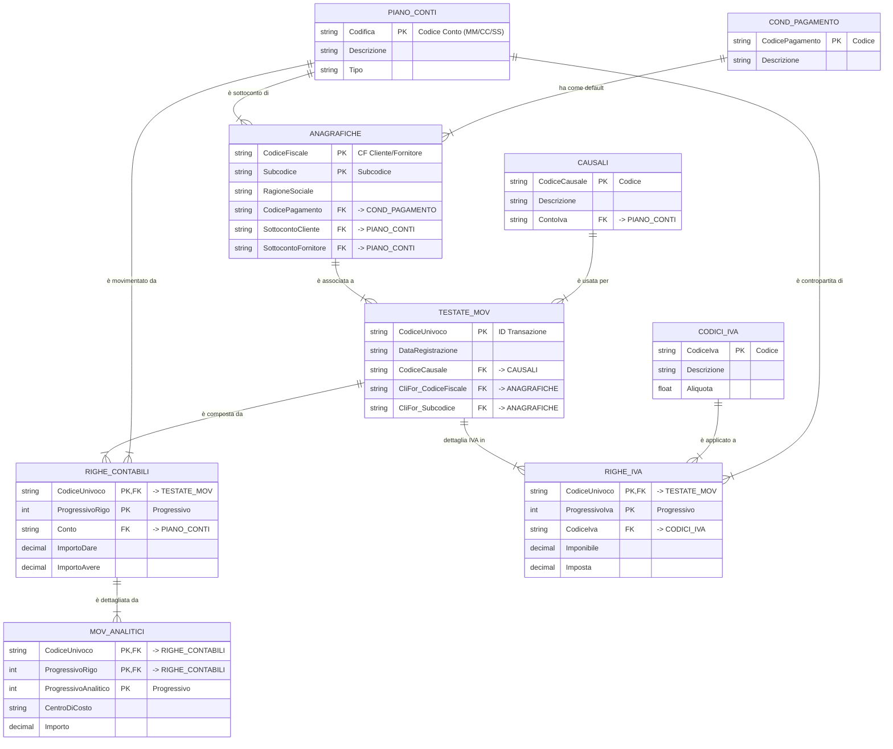

Certamente. Progettare correttamente le relazioni nel database è fondamentale per garantire l'integrità e l'efficienza del sistema.

Basandomi sull'analisi dei tracciati, ecco uno schema logico del database, con le tabelle, i campi chiave per le relazioni e il tipo di relazione (cardinalità).

### Schema Logico delle Relazioni del Database

Di seguito presento lo schema in due formati: una tabella descrittiva e uno schema grafico Entità-Relazione (ERD) per una visualizzazione più immediata.

#### Tabella Descrittiva delle Relazioni

| Tabella "Padre"   (Lato "Uno") | Campo Chiave Primaria | Tabella "Figlio"   (Lato "Molti") | Campo Chiave Esterna (Foreign Key) | Tipo di Relazione | Descrizione della Dipendenza |
| :--- | :--- | :--- | :--- | :--- | :--- |
| **PianiDeiConti**   `(da CONTIGEN)` | `Codifica` | **AnagraficheCliFor**   `(da A_CLIFOR)` | `SottocontoCliente`, `SottocontoFornitore` | **Uno-a-Molti** | Un conto può essere il sottoconto di molte anagrafiche. |
| **PianiDeiConti** | `Codifica` | **CausaliContabili**   `(da CAUSALI)` | `ContoIva`, `ContoIvaVendite` | **Uno-a-Molti** | Un conto può essere usato come conto IVA predefinito in più causali. |
| **PianiDeiConti** | `Codifica` | **RigheContabili**   `(da PNRIGCON)` | `Conto` | **Uno-a-Molti** | Un conto viene movimentato in molte righe contabili. |
| **PianiDeiConti** | `Codifica` | **RigheIva**   `(da PNRIGIVA)` | `Contropartita` | **Uno-a-Molti** | Un conto può essere la contropartita di molte righe IVA. |
| **CondizioniPagamento**   `(da CODPAGAM)` | `CodicePagamento` | **AnagraficheCliFor** | `CodicePagamentoDefault` | **Uno-a-Molti** | Una condizione di pagamento può essere lo standard per molte anagrafiche. |
| **CondizioniPagamento** | `CodicePagamento` | **TestateMovimenti**   `(da PNTESTA)` | `CodicePagamento` | **Uno-a-Molti** | Una condizione di pagamento può essere usata in molte testate (override). |
| **CodiciIva**   `(da CODICIVA)` | `CodiceIva` | **RigheIva** | `CodiceIva` | **Uno-a-Molti** | Un codice IVA può essere applicato a molte righe IVA. |
| **CausaliContabili** | `CodiceCausale` | **TestateMovimenti** | `CodiceCausale` | **Uno-a-Molti** | Una causale viene utilizzata per registrare molte testate di movimenti. |
| **AnagraficheCliFor** | `(CodiceFiscale, Subcodice)` | **TestateMovimenti** | `(CliFor_CodiceFiscale, CliFor_Subcodice)` | **Uno-a-Molti** | Un'anagrafica può essere associata a molte testate di movimenti. |
| **AnagraficheCliFor** | `(CodiceFiscale, Subcodice)` | **RigheContabili** | `(CliFor_CodiceFiscale, CliFor_Subcodice)` | **Uno-a-Molti** | Un'anagrafica può essere movimentata in molte righe contabili. |
| **TestateMovimenti** | `CodiceUnivoco` | **RigheContabili** | `CodiceUnivoco` | **Uno-a-Molti** | Una testata ha molte righe contabili (partita doppia). |
| **TestateMovimenti** | `CodiceUnivoco` | **RigheIva** | `CodiceUnivoco` | **Uno-a-Molti** | Una testata ha molte righe IVA (castelletto IVA). |
| **TestateMovimenti** | `CodiceUnivoco` | **MovimentiAnalitici**   `(da MOVANAC)` | `CodiceUnivoco` | **Uno-a-Molti** | Una testata può avere molti dettagli analitici. |
| **RigheContabili** | `(CodiceUnivoco, ProgressivoRigo)` | **MovimentiAnalitici** | `(CodiceUnivoco, ProgressivoRigo)` | **Uno-a-Molti** | Una riga contabile (es. un costo) può essere suddivisa su più centri di costo. |

---

### Schema Grafico Entità-Relazione (ERD)

Questo diagramma `mermaid` visualizza le relazioni descritte sopra. La notazione `PK` indica una Chiave Primaria e `FK` una Chiave Esterna. Il simbolo `---|{` indica una relazione "uno-a-molti".

### Riassunto delle Chiavi e delle Relazioni

1.  **Tabelle di Configurazione (`PIANO_CONTI`, `CODICI_IVA`, `CODPAGAM`, `CAUSALI`):**
    *   Sono le tabelle "master" o di "lookup".
    *   Le loro chiavi primarie (es. `Codifica`, `CodiceIva`, `CodicePagamento`, `CodiceCausale`) vengono usate come chiavi esterne (foreign keys) in quasi tutte le altre tabelle.

2.  **Tabella Anagrafiche (`ANAGRAFICHE`):**
    *   Ha una **chiave primaria composta** (`CodiceFiscale`, `Subcodice`) per identificare univocamente un soggetto.
    *   **Dipende** dalle tabelle di configurazione tramite le chiavi esterne per le condizioni di pagamento e i sottoconti contabili.

3.  **Tabelle dei Movimenti (`TESTATE_MOV`, `RIGHE_CONTABILI`, `RIGHE_IVA`, `MOV_ANALITICI`):**
    *   Formano una **struttura gerarchica**.
    *   **`TESTATE_MOV`** è il "padre" di tutta la transazione, identificato da `CodiceUnivoco`. Dipende da `CAUSALI` e `ANAGRAFICHE`.
    *   **`RIGHE_CONTABILI`** e **`RIGHE_IVA`** sono "figli" di `TESTATE_MOV`, collegate tramite la chiave esterna `CodiceUnivoco`. A loro volta, dipendono da `PIANO_CONTI` e `CODICI_IVA`.
    *   **`MOV_ANALITICI`** è il "figlio" di una `RIGHE_CONTABILI`, collegato tramite una **chiave esterna composta** (`CodiceUnivoco`, `ProgressivoRigo`).

Questo schema garantisce che i dati siano consistenti: non si può registrare un movimento per un fornitore che non esiste, né usare un'aliquota IVA non definita, e così via. È la base per un database contabile robusto e affidabile.